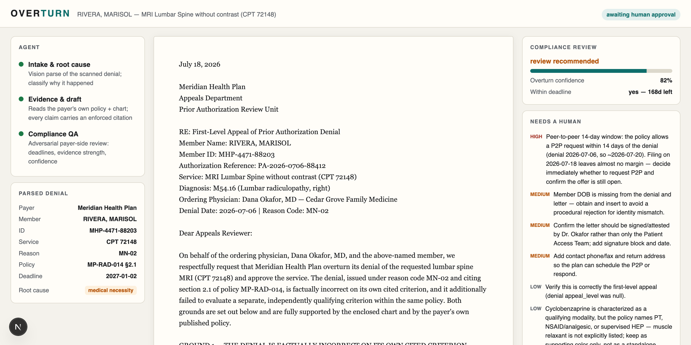

# Overturn

**An agentic appeals pipeline for clinic patient-access teams.** Denials arrive the way they arrive at every clinic — by fax. Each one flows through a visible pipeline (parse → evidence-chained draft → adversarial QA → decision), and a configurable **autonomy policy** decides when a human gets interrupted versus when the agent runs the show.



## The wedge

Everyone builds the gate — the systems that determine whether care gets authorized. Overturn is for what happens **after the gate says no**:

- **81.7%** of appealed Medicare Advantage prior-auth denials are fully or partially **overturned** (KFF/CMS, 2023)
- …but only **11.7%** of denials are ever appealed
- Each manual appeal takes ~45 minutes of chart-digging that patient-access teams don't have

The care — and the revenue — sit in the unfought appeals. The payer's own published policy is usually the strongest evidence against the payer's own denial. **The agent reads the policy more carefully than the payer did.**

## What it does

1. **Intake** — vision-parses the scanned denial PDF into a typed record (payer, member, CPT/ICD, reason code, cited policy section, deadlines) and classifies the root cause — via structured outputs against a JSON schema.
2. **Evidence & draft** — the centerpiece. The payer's own medical policy and the patient chart are attached as citation-enforced documents ([Anthropic citations API](https://platform.claude.com/docs/en/build-with-claude/citations)). Every claim in the drafted appeal carries a `cited_text` + location binding produced by the API — **the model structurally cannot fabricate a citation**. This is constrained generation with enforced provenance, not a letter template.
3. **Compliance QA** — a second, adversarial pass that reviews the letter the way a payer-side reviewer would: deadline math, per-claim evidence strength, procedural gaps, an overturn-confidence score, and explicit "needs a human" flags.
4. **Autonomy policy** — the decision layer. Three modes (human approves all / auto-submit when confident / agent runs the show), a confidence threshold, and a high-severity-flag interrupt. Analysis always runs; the policy gates only the send. Strong appeals fax back to the payer automatically (mocked); everything else lands in front of a coordinator with the reason spelled out.
5. **One evidence bundle, three renderings** — the appeal letter, a peer-to-peer brief for the ordering physician (one click when the payer escalates), and a plain-language patient SMS (mocked).

## The worklist is honest

Three of the four demo cases are **Synthea synthetic FHIR patients** flattened by script (`scripts/build-cases.ts`), not hand-built demos. (The raw [Synthea sample bundles](https://synthea.mitre.org/downloads) are not committed — drop `synthea_sample_data_fhir_latest/` into `fixtures/` to regenerate; the generated `cases/` and cached `runs/` are committed, so the app and replay work from a clean clone.) Their charts are thin, so their letters are honest and their confidence scores are low (65% / 42% / 30% vs the gold case's 82%) — which is the point: the engine tells the clinic **which fights to pick**, instead of pretending every appeal is a winner. Fax intake and outbound fax transmission are mocked, but both ends are plain PDF-in/PDF-out webhooks — the intake stage was built for messy scanned documents, which is exactly what fax delivers.

On the gold-path demo case, the agent finds **two independent grounds to overturn**: the denial is factually wrong on its own cited criterion (§2.1 — the chart documents 8 weeks of PT the payer said was missing), *and* the payer never evaluated its own §2.3, which the patient independently satisfies.

## Architecture notes

- TypeScript, Next.js approval surface, [`@anthropic-ai/sdk`](https://github.com/anthropics/anthropic-sdk-typescript), `claude-opus-4-8`.
- Citations and structured outputs are mutually exclusive per request in the Claude API — so extraction stages use schemas and the drafter uses citations. That split *is* the architecture: typed data where we need routing, enforced provenance where we need trust.
- Pipeline stages stream NDJSON progress to the UI; the drafter's tokens render live.
- Every stage's output caches to `runs/<case>/`, giving a replay path (`Replay cached run`) so a live demo can't be killed by network variance.

## Run it

```bash
npm install
cp .env.example .env   # add your ANTHROPIC_API_KEY

npm run pipeline       # full pipeline as a CLI on the gold case → runs/gold/
npm run dev            # approval surface at localhost:3000
```

In the UI: drop a denial PDF (or "Run the Rivera case live"), watch the agent work, hover the citation chips, approve the send.

## Honest limits

- Built in one day at the "Future of Agentic AI in Healthcare" hackathon (Abridge × Anthropic × Lightspeed, SF, July 18 2026).
- All patient data is **synthetic** (`fixtures/` — generated pre-event as data assets; all product code written at the event). No real patient, provider, or payer is depicted.
- Submission, fax, and SMS delivery are mocked. One denial type, one payer policy.
- **Not for clinical use.** A demo of an evidence-provenance pattern, not a medical device.
